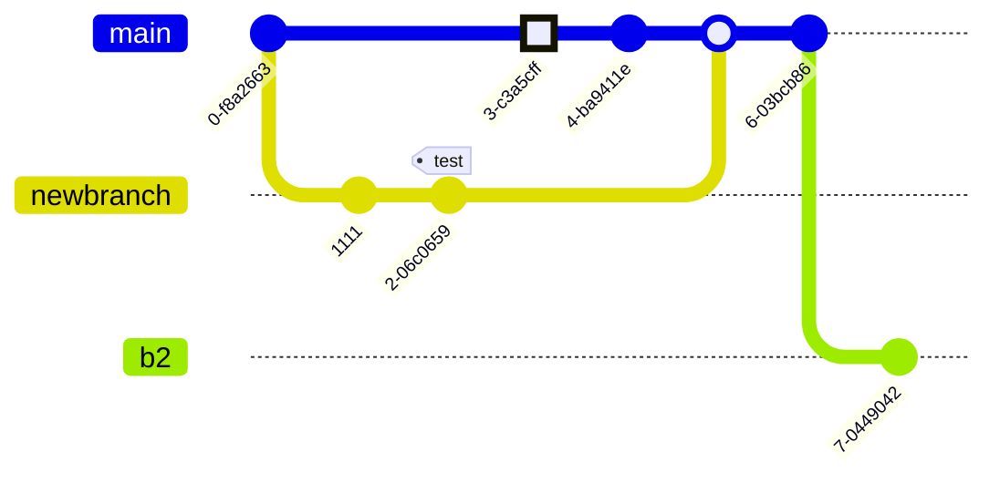

When writing technical content, clear visuals and equations can make a big difference. Mermaid and MathJax are two powerful tools that help you do just that—directly within your documents or web pages.

Mermaid allows you to create diagrams and flowcharts using a simple, text-based syntax. It’s perfect for illustrating processes, decision trees, and system architecture without needing graphic design tools.

MathJax lets you display beautifully rendered mathematical equations using LaTeX or MathML. It ensures your formulas look professional and work seamlessly across all browsers and devices.

These tools make your technical writing more engaging, readable, and precise—without ever leaving your code editor.

<!--more-->

Arberia Theme for Hugo supports native Mermaid diagrams and MathJax equations. Thanks to contribution of Wachin [https://github.com/wachin](https://github.com/wachin) 

## Mermaid
Mermaid is a simple markdown-inspired tool that lets you create diagrams and flowcharts using plain text. It's ideal for developers and technical writers who want to visualize processes, systems, or data structures directly in their documentation or code. Look at official website to learn how to use it: [https://mermaid.js.org/](https://mermaid.js.org/) 

### Basic flowchart


### Pie chart


### A commit flow diagram. 




## MathJax Equations

MathJax is a powerful JavaScript library that displays mathematical notation in web pages using LaTeX, MathML, or AsciiMath. It renders equations with high-quality typography, ensuring they look great across all browsers and devices—without requiring users to install any plugins.

Look at official website to learn how to use it: [https://www.mathjax.org/](https://www.mathjax.org) 

Below some useful example: 

1) Inline equation: 

```
$E = mc^2$
```

$E = mc^2$

1) Block equation: 

```
$$\int_{-\infty}^{\infty} e^{-x^2} dx = \sqrt{\pi}$$
```

$$\int_{-\infty}^{\infty} e^{-x^2} dx = \sqrt{\pi}$$